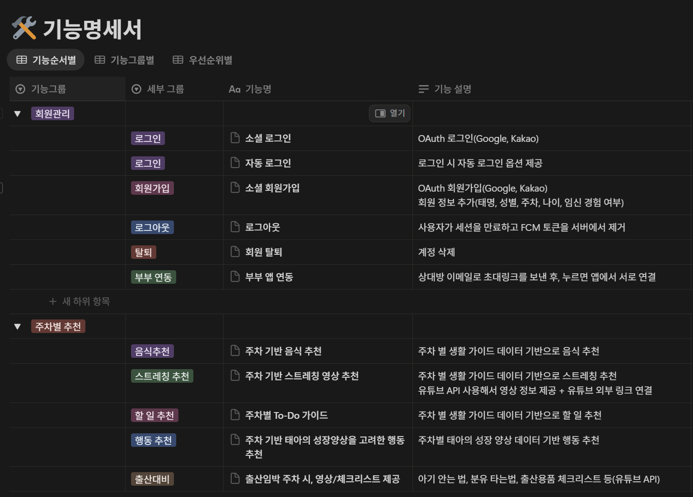
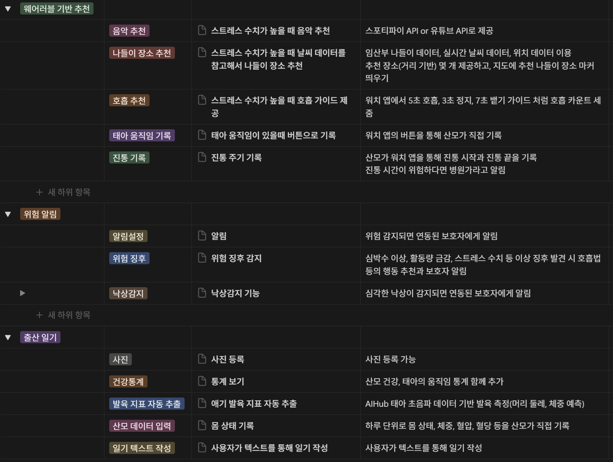
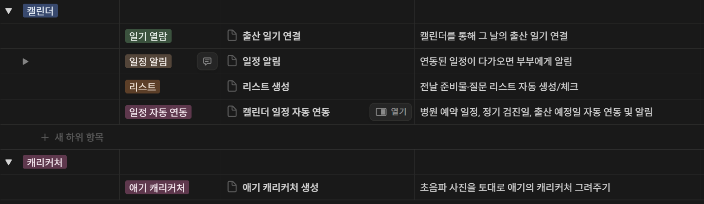
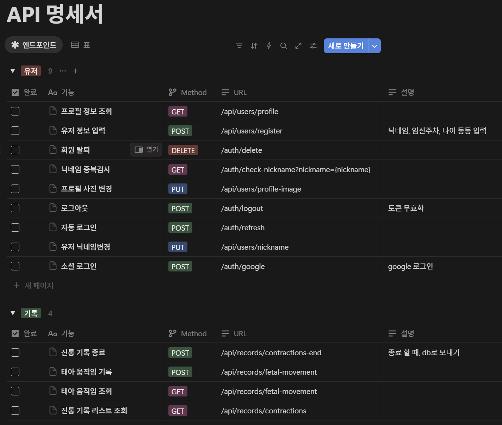
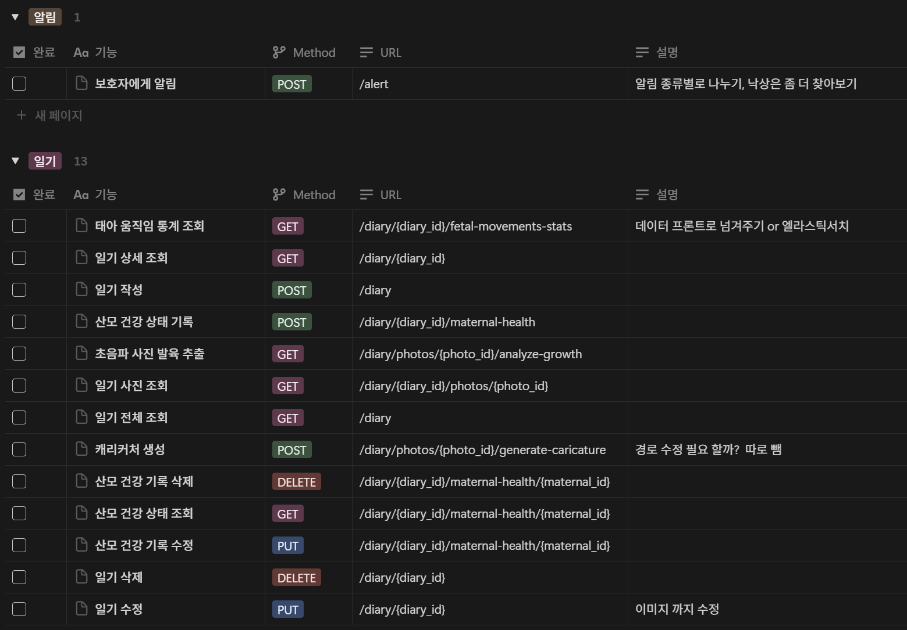
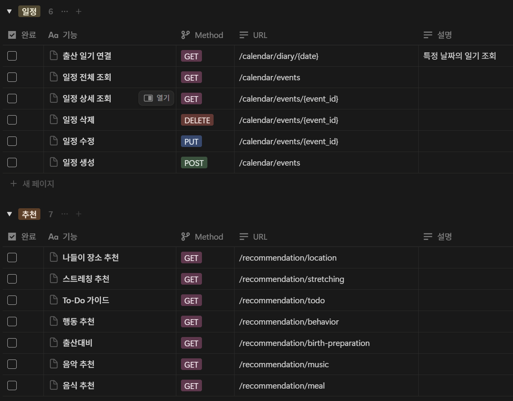
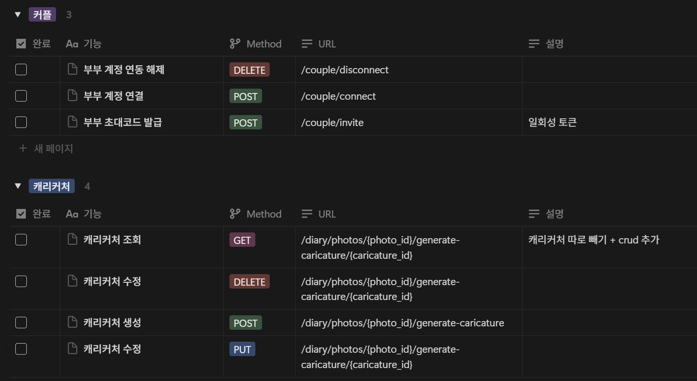
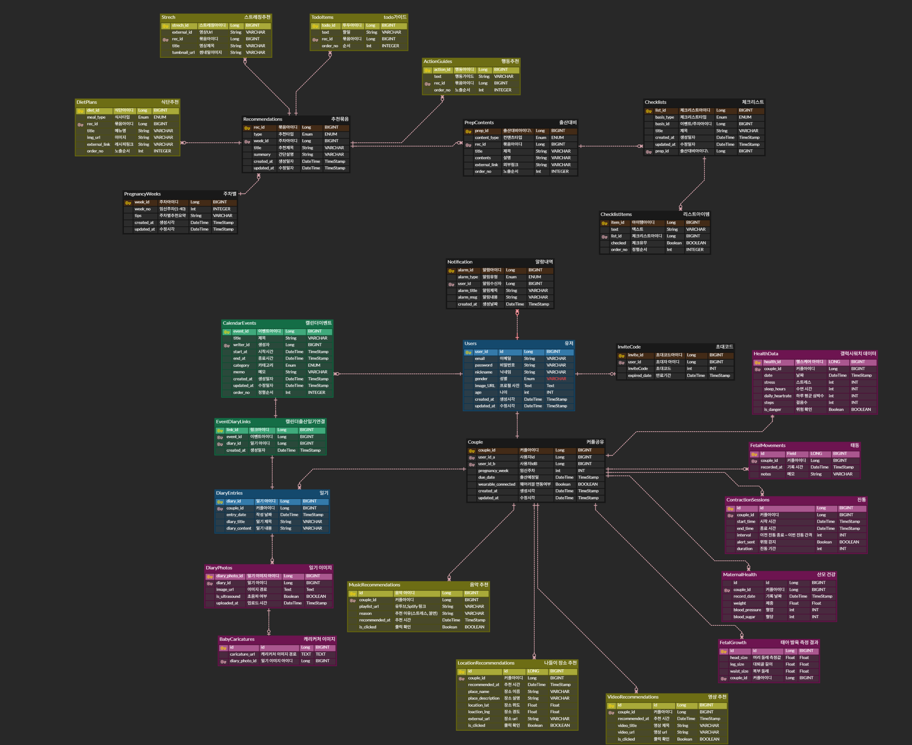
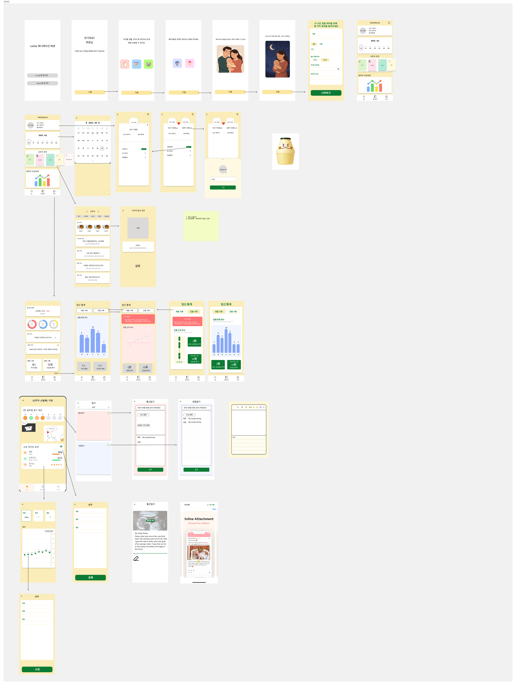

# 서비스명: HelloWorld
> 개발자라면 누구나 처음 작성하는 코드가 "Hello World" 입니다. 이 간단한 문장은 새로운 세계로의 첫 걸음을 의미하고 프로그래머로서 성장의 시작을 상징합니다.
저희 팀은 이 상징성을 임산부 케어 앱에 담았습니다.
아기가 세상에 처음으로 “Hello”라고 인사하는 순간까지 산모와 가족을 곁에서 함께 돕고 지켜주겠다는 마음을 담아 Hello World라는 이름을 팀명으로 정했습니다.
개발자의 첫 코드처럼 새로운 시작을 의미하는 동시에 아기가 세상에 처음 인사하는 순간을 지원하는 서비스라는 의미를 가진 이름입니다.
 

## 기획배경
> 한국에서 산후우울증의 유병률은 약 24.3%에 달하며 이는 상당히 높은 수준입니다. 최근 연구에 따르면 산후 정신건강은 우울증 뿐 아니라 스트레스, 불안 등의 다양한 형태로 나타나며 산후 스트레스는 오히려 우울증보다 더 흔하다고 지적되고 있습니다.
이처럼 출산 이후 정신적 부담이 크지만 정작 효과적인 관리와 지원은 부족한 상황입니다. 따라서 우리는 웨어러블 기반 데이터를 활용해 실시간으로 산모의 상태를 파악하고 맞춤형 케어와 예방 중심의 관리를 제공하는 임산부 케어앱을 기획하게 되었습니다.

 

## MVP 기능
1. 주차별 추천(음식, 스트레칭, 할 일, 행동, 출산 대비 체크리스트)
2. 웨어러블 기반 추천(음악, 나들이 장소, 호흡, 태아 움직임 기록, 진통 기록)
3. 출산 일기(주차별 요약 리포트 생성, 산모(출산일기), 남편(관찰일기))
4. 캘린더 일정 관리(일정 알림)
5. 초음파 이미지 분석(캐리커처, 애기 발육 지표 자동 추출)
6. 부부연동(초대코드)

 

## 후순위 기능
1. 태동-반응 아기 캐릭터
2. 입덧 맞춤 기능
3. 모든 일기 모아보는 앨범

 

## 문서화

 

### 1. 기능명세서

 

### 2. API 명세서

### 3. ERD 다이어그램

 

### 4. 와이어프레임

 