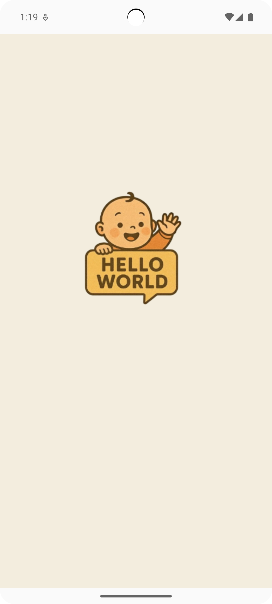

# TEAM HelloWorld — 임산부 케어 & 빅데이터 추천 서비스

> 임신 주차·상태에 맞춘 **맞춤 케어**와 **가족 연동형 기록**을 제공하는 모바일 서비스  
> S3 Presigned URL 기반 **미디어 업/다운로드**, **DALL·E-3 캐리커처**, **일기/사진 보관**까지 한 번에

 

## 📑 목차
1. [프로젝트 소개](#-프로젝트-소개)
2. [주요 기능](#-주요-기능)
3. [주요 화면 및 기능 소개](#-주요-화면-및-기능-소개)
4. [주요 기술](#-주요-기술)
5. [기술 스택](#-기술-스택)
6. [시스템 아키텍처](#%EF%B8%8F-시스템-아키텍처)
7. [팀원 정보](#-팀원-정보)

 

## 📋 프로젝트 소개

**HelloWorld** 는 임산부의 일상 기록과 가족 연동을 중심으로, **주차별/상태별 맞춤 추천**을 제공하는 케어 서비스입니다.  
산모/남편(보호자) 일기, 캘린더, 초음파·음식 사진 등 **미디어를 안전하게 저장**하고 공유합니다.  
초음파 이미지는 **DALL·E-3 캐리커처**로 변환해 추억을 남길 수 있으며, 모든 미디어는 **S3 Presigned URL**로 안전하게 전송됩니다.

### 프로젝트 정보

| 항목 | 내용 |
| --- | --- |
| 팀명 | HelloWorld |
| 서비스명 | HelloWorld |
| 개발 기간 | 2025.08 ~ 2025.09 (6주) |
| 개발 인원 | 6명 / Android(2), Backend(2), BigData(1), 나 DevOps(1) |
| 내 역할 | **DevOps & Backend** (CI/CD, 관찰성, S3 Presigned API, DALL·E-3 연동) |

 

## ✨ 주요 기능

### 1) 산모/남편 일기 & 미디어 보관
- 텍스트 일기 + 사진(음식, 초음파, 생활) 업로드
- S3 **Presigned URL**로 안전한 업/다운로드 (대용량 안정성, 엣지 캐시 친화)

### 2) 초음파 캐리커처(DALL·E-3)
- 초음파 이미지를 업로드하면 **DALL·E-3**가 귀여운 캐리커처 생성
- 결과 이미지를 **S3에 저장**하고, 앱에는 **Presigned URL**로 전달

### 3) 캘린더 & 체크리스트
- 주차별 체크리스트(검진, 준비물, 운동)
- 일정 알림 및 완료율 통계

### 4) 가족 연동
- 초대코드로 **남편/보호자** 연동, 각자 일기와 사진 열람/댓글
- 산모/가족 활동 내역 시간순 피드

### 5) 주차/상태 기반 추천
- 주차·증상·기분 태그 기반 **맞춤 가이드/콘텐츠** 추천(빅데이터 담당 연동 포인트)

 

## 🚀 주요 화면 및 기능 소개

> 실제 스크린샷/GIF 경로를 프로젝트에 맞게 교체하세요.

### 1. 온보딩 & 홈
- 주차 설정, 홈 대시보드(오늘의 할 일/리포트/알림)

  

### 2. 일기 작성 & 미디어 업로드
- 텍스트 + 사진(다중) 업로드 → **S3 Presigned 업로드** 진행

  

### 3. 초음파 캐리커처
- 초음파 이미지 선택 → **DALL·E-3 API** 호출 → 결과 미리보기 및 저장

  

### 4. 캘린더 & 체크리스트
- 일정 등록, 주차별 체크리스트 자동 생성/완료 처리

  

### 5. 가족 연동
- 초대코드로 연동, 활동 피드와 댓글

  

 

## 🔬 주요 기술

<strong>S3 Presigned URL 업/다운로드</strong>

- **업로드**: 앱이 백엔드에 업로드 요청 → 서버가 S3 **PUT** Presigned URL 발급 → 앱이 URL로 직접 업로드  
- **다운로드**: 서버가 **GET** Presigned URL 발급 → 앱이 서명 URL로 즉시 다운로드  
- 장점: 서버 부하/트래픽 절감, 대용량 안정성, 권한 제어 명확
- 백엔드: Java 17 / Spring Boot, AWS SDK for Java v2

<strong>DALL·E-3 캐리커처 파이프라인</strong>

- 업로드된 초음파 이미지 → 프롬프트 가공 → **DALL·E-3** 이미지 생성  
- 생성 이미지를 S3에 저장하고 앱에는 **Presigned URL** 전달  
- 실패/시간초과 대응, 재시도/웹훅(선택) 설계

<strong>CI/CD & Observability</strong>

- **Jenkins + Kaniko**: 코드 변경 서비스만 **이미지 빌드/푸시** → k3s에 **RollingUpdate** 배포  
- **Traefik + cert-manager**: Ingress/TLS 자동화  
- **Prometheus/Grafana/Loki**: 지표/로그/알람. 배포 시간, 에러율, 지연 시간 대시보드 운영  
- 결과: 서비스(Deploy) **1m18s → 58s**, 메모리 튜닝(OOM 방지) 후 안정성↑

 

# 📚 기술 스택

## 📱 Android
- **Kotlin** 2. / **Android SDK** 35  
- **Jetpack**: Compose, DataStore, Lifecycle, Navigation  
- **Hilt(DI)**, **Retrofit/OkHttp**, **Firebase(FCM)**  

---

## ⚙️ Backend
- **Java (OpenJDK)** 17  
- **Spring Boot** 3.5.5, **REST API**  
- **JPA**  
- **S3 Presigned** API, **OpenAI(DALL·E-3)** 연동  
- DB: **PostgreSQL** 16.10  
- IDE: IntelliJ IDEA 2025.02.01

---

## ☁️ Infra & DevOps
- **AWS EC2** (k3s 단일/멀티 노드)
- **Docker / Docker Hub / k3s**
- **Jenkins + Kaniko** (컨테이너 빌드/푸시)
- **Helm**, **Traefik**, **cert-manager**
- **Prometheus / Grafana / Loki / k6**
- **GitLab** (SCM)

---

## 🧩 Collaboration
- Git / GitLab / Jira / Figma / Discord / Notion / Mattermost

 

## 🏗️ 시스템 아키텍처

> Android ↔ Spring Boot(API) ↔ S3/DB  
> Jenkins(Kaniko) → Docker Hub → k3s(Helm) → Traefik/Ingress  
> Prometheus/Grafana/Loki 로 **배포/지연/에러율** 가시화

 

## 👨‍👩‍👧‍👦 팀원 정보

| 🧑‍💻 이름 | 🏆 역할 | ✉️ 이메일 |
|---|---|---|
| 최윤수 | 팀장, Android |  gews300255@gmail.com |
| 이상헌 | Android | rntehr2@gmail.com |
| **송진우** | **Android · DevOps/Backend 보조** | rkddkwl059@naver.com |
| 정보균 | Backend | a01071521583@gmail.com |
| 홍은솔 | Backend | eunsolhh@gmail.com |
| 최혜정 | BigData | hhaa0423@gmail.com |

 

## 📎 부록
- [ERD](https://www.erdcloud.com/d/AAFYetJsXD6wbeZff)
- [API 명세](https://www.notion.so/API-261b8bebd93a802cac7af64894acbfde)
- [대시보드 샷](assets/helloworld_grafana.png)
